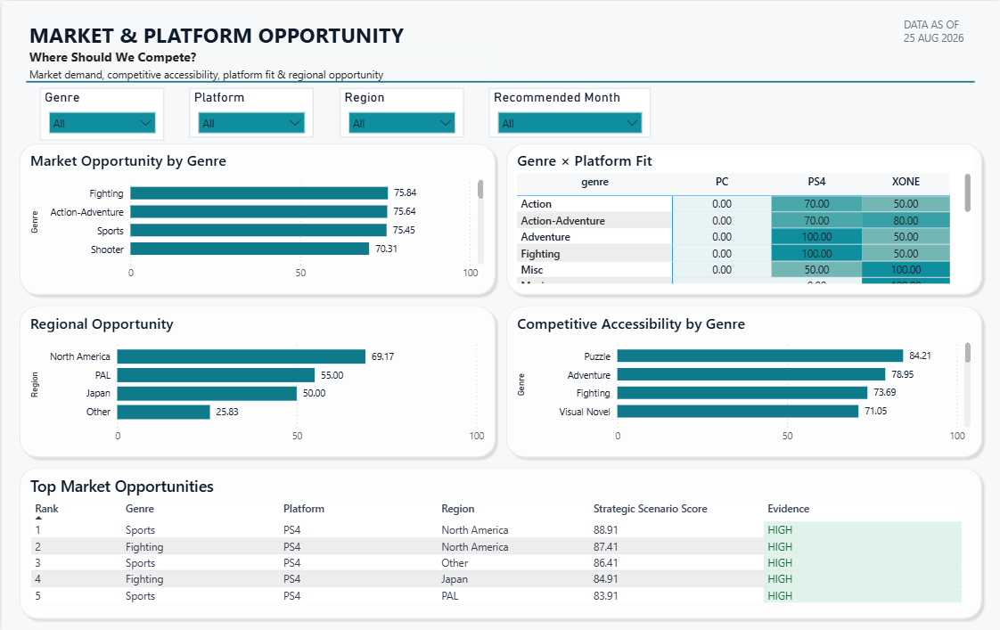
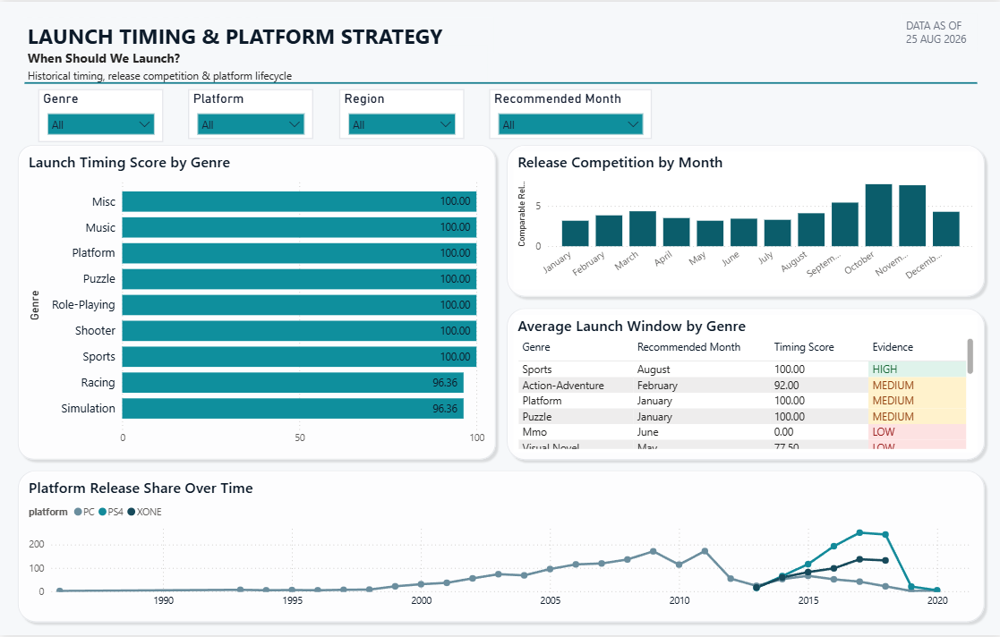

# Power BI

## Purpose

The `Power_BI` layer is the presentation and stakeholder-consumption layer of the **Gaming Launch Intelligence** project. It does not perform new analysis. It takes the nine validated SQL exports (and, where noted, the Python model-diagnostics outputs) and turns them into an interactive, decision-support dashboard aimed at answering the project's business question: *should we launch this game as planned, and where should we invest our marketing budget?*

Every number on the dashboard traces back to a `SQL_Analysis/Result/*.csv` export. The Power BI layer's job is to make those numbers explorable, comparable, and legible to a non-technical stakeholder — not to recompute or reinterpret them.

## Folder Structure

```text
Power_BI/
│
├── Game_Launch_Intelligence.pbix
│
└── Dashboard_Previews/
    ├── Executive_Overview.png
    ├── Market_Platform_Opportunity.png
    ├── Launch_Timing_Platform_Strategy.png
    └── Executive_Insights.png
```

## Report Pages

### 1. Executive Launch Overview

The entry-point page. Headline KPIs — Total Scenarios, GO Rate, Avg Strategic Score, Avg Success Probability, Evidence Quality (out of 100) — a decision-mix donut (GO / CONDITIONAL / AVOID), an average Strategic Scenario Score by platform, and a Top Launch Scenarios table sorted by Strategic Scenario Score descending.


### 2. Market & Platform Opportunity

Answers *where should we compete?* Market Opportunity by genre, a Genre × Platform Fit matrix, Regional Opportunity by region, Competitive Accessibility by genre, and a Top Market Opportunities table ranked by Strategic Scenario Score with evidence quality flagged per row.



### 3. Launch Timing & Platform Strategy

Answers *when should we launch?* Launch Timing Score by genre, Release Competition by month, an Average Launch Window by genre table, and a Platform Release Share Over Time chart showing each platform's generational lifecycle (used to visually justify why only PC, PS4, and XONE survive into the final decision set).



### 4. Executive Insights

Answers *what should we prioritise?* Top-line recommendation cards (Top Opportunity Genre, Best Launch Month, Recommended Platform, Market Opportunity Score, Confidence Level), an Opportunity by Genre chart, a Top 5 Strategic Opportunities table, a Best Selling Platform by Sales donut, and a Key Insights panel.


This page also carries the dashboard's central finding, called out explicitly rather than left implicit:

> **Note:** The top-ranked opportunities by Strategic Scenario Score are classified CONDITIONAL, not GO — their model-predicted success probability sits at 41–47%, below the threshold required for a GO. Strong historical market opportunity does not automatically imply high predicted commercial success; the decision engine treats these as two independent dimensions, and requires both to align before recommending GO.

## Data Sources Consumed

All nine SQL exports from `SQL_Analysis/Result/` are imported:

```text
phase2_market_opportunity.csv
phase2_competitive_accessibility.csv
phase2_genre_platform_fit.csv
phase2_regional_opportunity.csv

phase4_launch_timing_scenarios.csv
phase4_release_competition_density.csv
phase4_platform_lifecycle.csv

phase5_scenario_score.csv
phase5_final_launch_decision.csv
```

`phase5_final_launch_decision.csv` is the primary table behind Pages 1 and 4. `phase2_*` files drive Page 2. `phase4_*` files drive Page 3.

## Key DAX Measures

Most KPI cards are direct aggregations (`COUNTROWS`, `AVERAGE`, `DIVIDE`) against `phase5_final_launch_decision`. Two measures needed explicit logic:

**Average Evidence Quality** — converts the categorical `scenario_evidence_quality` field into a weighted score out of 100, since no raw numeric evidence score exists in the export:

```dax
Average Evidence Quality =
AVERAGEX(
    phase5_final_launch_decision,
    SWITCH(
        phase5_final_launch_decision[scenario_evidence_quality],
        "HIGH", 100,
        "MEDIUM", 70,
        "LOW", 40,
        BLANK()
    )
)
```

**Historical Sales Share** — PS4's share of total historical sales, used on Page 4 and kept consistent with the Best Selling Platform by Sales donut so the KPI card and the chart can't drift out of agreement with each other.

## Filters and Interactivity

Genre, Platform, Region, and Recommended Month slicers appear on all four pages and are synced, so a filter selection carries across the whole report rather than resetting per page.

## Design Conventions

Decision categories (`GO` / `CONDITIONAL` / `AVOID`) use a consistent traffic-light colour convention wherever they appear — green / amber / red — applied through conditional formatting rather than picked per visual, so colour always means the same thing across every page.

## SQL → Python → Power BI Flow

```text
PostgreSQL source/conformed data
          ↓
      SQL analysis
          ↓
     Python Analysis
          ↓
model_success_predictions.csv
          ↓
06a_load_model_predictions.sql
          ↓
07_final_decision_engine.sql
          ↓
08_export_results.sql
          ↓
Nine analytical CSV exports
          ↓
      Power BI
          ↓
Interactive decision-support dashboard
```

## Reproduction Instructions

1. Confirm all nine files exist in `SQL_Analysis/Result/` (run the SQL pipeline through `08_export_results.sql` if not).
2. Open `Game_Launch_Intelligence.pbix` in Power BI Desktop.
3. If the file paths have changed, update the data source paths under **Transform Data → Data Source Settings** to point at the current `SQL_Analysis/Result/` location.
4. Click **Refresh** to reload all nine tables.
5. Confirm KPI totals match the validated figures below (see Validation) before treating the refreshed report as current.

## Validation

Against the current SQL export run, the dashboard should reflect:

```text
Total Scenarios     164
GO                    2
CONDITIONAL         157
AVOID                 5

Surviving platforms: PC, PS4, XONE
```

If a refreshed `.pbix` shows different totals, the underlying SQL exports have changed and the Power BI-layer numbers in this README (and the Dashboard_Previews) should be re-generated to match.

## Important Assumptions and Limitations

- This is a 4-page dashboard by design. It does not currently include a what-if scenario weight explorer, a key-influencers visual, drillthrough into title-level competition data, or a model-diagnostics page — all of these were scoped out, not overlooked.
- Only 3 of the original platforms (PC, PS4, XONE) survive to the final decision set; retired platforms were excluded upstream in the SQL layer, not in Power BI.
- Only 2 of 164 scenarios reach a GO decision. This is the model's actual output, not a display artefact, and is called out directly on Page 4 rather than smoothed over.
- The dashboard visualises the SQL and Python layers' outputs; it does not independently validate them. Any correction to an upstream export requires a Power BI refresh, not a dashboard-side fix.
- As with the SQL and Python layers, `GO` / `CONDITIONAL` / `AVOID` are decision-support labels, not investment approvals, and should be read alongside the assumptions documented in `SQL_Analysis/README.md` and `Python_Analysis/README.md`.

## Current Status

The Power BI layer is complete for its current scope: four pages, all nine SQL exports connected, synced cross-page filtering, and consistent decision-colour conventions throughout. This is the final presentation layer of the project — the dashboard is the artefact a stakeholder or reviewer is intended to interact with directly.
