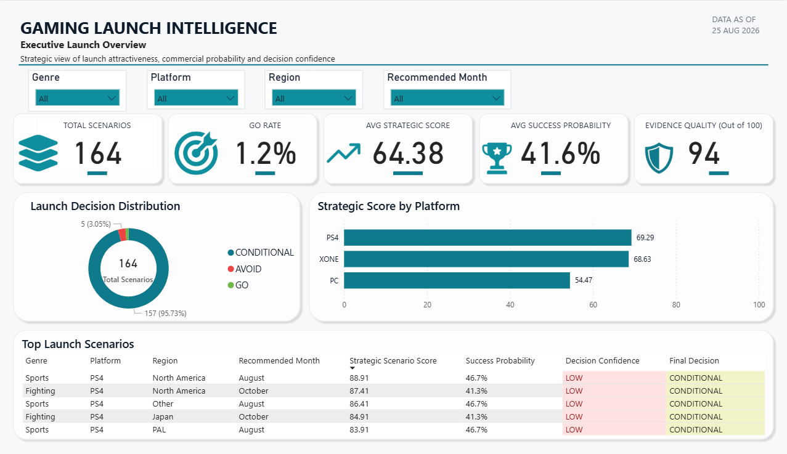
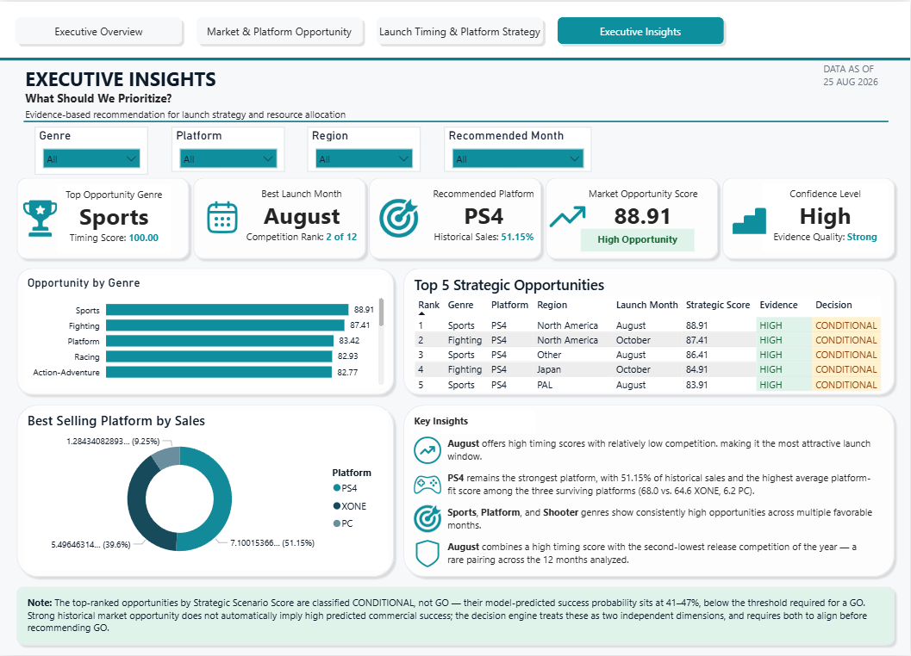

# 🎮 Gaming Launch Intelligence

### Predicting Commercial Success & Optimising Platform, Launch Timing, and Marketing Strategy


**"Should we launch this game as planned, and where should we invest our marketing budget?"**

This project answers that question end-to-end — a PostgreSQL analytical pipeline, a Random Forest success-prediction model in Python, and an interactive Power BI dashboard, working as one connected decision-support system rather than three disconnected exercises. Every number on the dashboard traces back through the model to a specific SQL view to a specific raw dataset — nothing on the report layer is invented or eyeballed.

---

## 📊 Dashboard Preview

<p align="center">
  
  
</p>

Two of four report pages — full dashboard walkthrough and every page in [`Power_BI/README.md`](Power_BI/README.md).

---

## 🔑 Key Results

- **164 launch scenarios evaluated** (genre × platform × region × recommended month) → **2 GO · 157 CONDITIONAL · 5 AVOID**
- **PC, PS4, and XONE** are the only platforms that survive to the final decision set — retired platforms (PS2, DS, PSP, GBA, XB) are excluded upstream once their release lifecycle has ended, not filtered cosmetically on the dashboard
- **PS4 is the recommended platform** — highest average platform-fit (68.0) and strategic score (69.3) of the three survivors, and **51.15%** of historical sales across them
- **August is the strongest historical launch window** — the highest timing score of any month, paired with the second-lowest release competition of the year
- **Random Forest success model**: ROC AUC **0.85** on a temporal holdout (trained on pre-2018 data, tested on 2018 releases — not a random split, so it's genuinely predicting forward in time), F1 **0.61** at the tuned decision threshold
- **The central finding, stated plainly rather than buried**: the *highest-opportunity* scenario in the entire analysis — Sports on PS4 in North America, launching August, strategic score 88.91 — is still only **CONDITIONAL**, because its model-predicted success probability is **46.7%**. Strong historical market opportunity does not automatically mean high predicted commercial success. The decision engine treats these as two independent dimensions and requires both to align before recommending GO — which is exactly why only 2 of 164 scenarios do.

---

## ❓ Business Questions Answered

1. **Which platform should we prioritise?**
2. **Which genre × platform combinations represent the strongest opportunities?**
3. **Which regions and launch windows deserve investment?**
4. **Which scenarios should management greenlight, conditionally validate, or avoid?**

---

## 🏗️ Architecture

```text
Raw multi-source game data (vgchartz, Video Games, Steam, SteamSpy)
                    ↓
        PostgreSQL: cleaning, data modelling, source reconciliation
                    ↓
        Python: statistical analysis + Random Forest success model
                    ↓
        PostgreSQL: model predictions loaded back in (06a)
                    ↓
        PostgreSQL: Phase 5 strategic decision engine (07)
                    ↓
        PostgreSQL: 9 validated CSV exports (08)
                    ↓
        Power BI: 4-page interactive decision-support dashboard
```

Statistical modelling stays in Python; the final strategic decision framework stays transparent and queryable in SQL rather than buried inside a notebook or a DAX measure. Full breakdown of each stage in the layer-specific READMEs linked below.

---

## 🛠️ Tech Stack

| Layer | Tools |
|---|---|
| **Data** | 4 raw multi-source datasets (vgchartz-2024, Video Games, Steam, SteamSpy) |
| **Database** | PostgreSQL — 11 numbered SQL scripts + orchestration runner |
| **Analysis & ML** | Python 3.12 · pandas · NumPy · scikit-learn · statsmodels · SciPy · seaborn · Plotly |
| **BI & Reporting** | Power BI Desktop · DAX |
| **Environment** | uv (dependency and environment management) · Jupyter |

---

## 📁 Repository Structure

```text
Game_Launch_Intelligence/
│
├── Game_Data/                  Raw multi-source input datasets
│
├── SQL_Analysis/                → SQL_Analysis/README.md
│   ├── Analysis/                12 SQL scripts: cleaning → market analysis →
│   │                            launch timing → decision engine → export
│   └── Result/                  9 validated analytical CSV exports
│
├── Python_Analysis/              → Python_Analysis/README.md
│   ├── notebooks/                5 notebooks: cleaning/EDA, statistics,
│   │                             visualisation, multi-source audit, timing methodology
│   └── outputs/                  Model predictions, diagnostics, 32 exported figures
│
├── Power_BI/                     → Power_BI/README.md
│   ├── Game_Launch_Intelligence.pbix
│   └── Dashboard_Previews/       PNG export of every report page
│
├── main.py / pyproject.toml / requirements.txt / uv.lock
└── README.md                     you are here
```

Each subfolder's README documents that layer in full — execution order, exact outputs, validation checks, and assumptions. This root README is the map; the layer READMEs are the territory.

---

## 🧪 Methodology at a Glance

**1. Data engineering** — 64,016 raw multi-platform records cleaned and modelled down to ~18,850 analytical rows in PostgreSQL, cross-checked against three supplementary datasets (Video Games, Steam, SteamSpy) in a dedicated multi-source audit notebook.

**2. Statistical analysis** — hypothesis testing (Kruskal-Wallis, Mann-Kendall, Shapiro-Wilk) and Gini/Lorenz concentration analysis to establish which patterns are statistically meaningful before anything gets built on top of them.

**3. Predictive modelling** — a Random Forest classifier trained on engineered "prior" features (genre/publisher/developer/console historical average sales and hit-rate) to avoid leaking future information into the model. Validated on a **temporal holdout** (train on pre-2018, test on 2018) rather than a random split — ROC AUC 0.85, with calibration and per-genre robustness (AUC 0.73–0.97 across genres) checked explicitly rather than assumed.

**4. Strategic decision engine** — a transparent, weighted scoring model in SQL (market opportunity 35%, platform fit 25%, regional opportunity 15%, timing 15%, evidence quality 10%) combined with the model's success probability to classify every genre × platform × region × month combination as GO, CONDITIONAL, or AVOID.

**5. Interactive dashboard** — a 4-page Power BI report translating all of the above into a stakeholder-facing decision tool, with synced cross-page filtering and consistent decision-colour conventions throughout.

---

## 💡 Skills Demonstrated

- End-to-end pipeline design across three tools (PostgreSQL → Python → Power BI) with a clean, one-directional handoff at each stage
- Multi-source data reconciliation and data-quality auditing
- Statistical hypothesis testing and non-parametric methods
- Predictive modelling with leakage-aware feature engineering and temporal (not random) validation
- Model evaluation beyond accuracy: calibration curves, subgroup robustness, threshold tuning
- Transparent, auditable business-rule design (a weighted decision framework readable in plain SQL, not a black box)
- DAX measure design and dimensional data modelling in Power BI
- Recognising and stating findings that don't fit the "good news" narrative — the CONDITIONAL-heavy result is reported directly, not smoothed over
- Project documentation written for someone who wasn't in the room when it was built

---

## ⚙️ How to Reproduce

1. Set up PostgreSQL and run the numbered scripts in `SQL_Analysis/Analysis/` in order (or use `run_pipeline.sql`) — see `SQL_Analysis/README.md` for the full sequence.
2. Run the Python notebooks in `Python_Analysis/notebooks/` in order to generate the statistical analysis and `model_success_predictions.csv` — see `Python_Analysis/README.md` for the required source dataset and setup.
3. Run `06a_load_model_predictions.sql` followed by `07_final_decision_engine.sql` and `08_export_results.sql` to produce the final 9 CSV exports.
4. Open `Power_BI/Game_Launch_Intelligence.pbix` in Power BI Desktop and refresh — see `Power_BI/README.md` for data-source paths and validation figures.

Dependencies are managed with `uv` (`pyproject.toml` / `uv.lock`); a plain `requirements.txt` is also provided.

---

## ⚠️ Assumptions & Limitations

- Historical sales and release data are the evidence base — historical performance does not guarantee future commercial success.
- The strategic scenario score is a decision-support score, not a probability; success probability and strategic opportunity are treated as separate, independently-required dimensions.
- `GO` / `CONDITIONAL` / `AVOID` are rule-based decision-support outputs, not automatic investment approvals, and should be read alongside current market conditions and financial constraints not captured in historical data.
- Full assumptions and validation detail live in each layer's own README — `SQL_Analysis/README.md`, `Python_Analysis/README.md`, `Power_BI/README.md`.

---

## 👤 Author

**Mayank** — Final-year B.E. student, Artificial Intelligence & Data Science
📍 Amravati, Maharashtra, India

[LinkedIn](https://www.linkedin.com/in/agrawal-mayank-anil/) · [GitHub](https://github.com/MayankAgrawal099) · [Email](mailto:mayank.agrawal.co@gmail.com)
